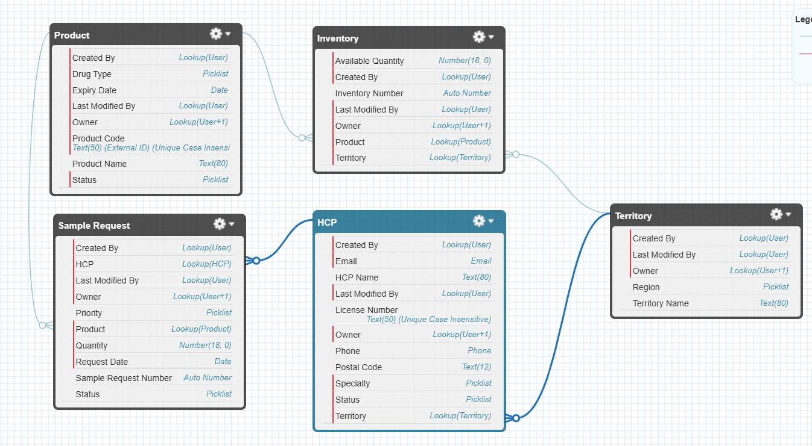

# Clearview Design Documentation

## Entity Relationship Diagram

## Object Model Overview

### Core Objects
1. **HCP__c (Healthcare Provider)**
   - Tracks healthcare professionals who can request samples
   - Includes contact details, license information, and specialty
   - Connected to Territory__c for regional management

2. **Product__c**
   - Manages sample product information
   - Tracks drug type, expiry dates, and product status
   - Referenced by Sample_Request__c and Inventory__c

3. **Sample_Request__c**
   - Central object for sample request management
   - Links HCPs to Products
   - Includes quantity, priority, and request tracking

4. **Inventory__c**
   - Manages product availability by territory
   - Tracks available quantities
   - Links Product__c to Territory__c

5. **Territory__c**
   - Defines geographic regions
   - Supports regional inventory management
   - Connected to both HCP__c and Inventory__c

## Object Relationships
### Primary Relationships
- **HCP__c → Territory__c**: Each HCP belongs to one Territory (Lookup)
- **Sample_Request__c → HCP__c**: Each request is associated with one HCP (Lookup)
- **Sample_Request__c → Product__c**: Each request is for one Product (Lookup)
- **Inventory__c → Product__c**: Each inventory record tracks one Product (Lookup)
- **Inventory__c → Territory__c**: Each inventory is assigned to one Territory (Lookup)

### Delete Behavior
All lookup relationships use Restrict delete behavior to maintain data integrity.

## Key Fields and Features

### HCP__c
- Auto-name field (Name)
- Email__c (Email)
- License_Number__c (Text)
- Phone__c (Phone)
- Specialty__c (Picklist)
- Status__c (Picklist)

### Product__c
- Auto-name field (Name)
- Drug_Type__c (Picklist)
- Expiry_Date__c (Date)
- Product_Code__c (Text)
- Status__c (Picklist)

### Sample_Request__c
- Auto-number (SR-{0000})
- Priority__c (Picklist: Normal, High, Urgent)
- Quantity__c (Number)
- Request_Date__c (Date)
- Status__c (Picklist: Requested, In Progress, Fulfilled, Rejected)

### Inventory__c
- Auto-number (INV-{0000})
- Available_Quantity__c (Number)

### Territory__c
- Text name field (Name)
- Region__c (Picklist: North, South, East, West, Central)

## Technical Features
- Field History Tracking enabled on all objects
- Reports enabled for all objects
- Standard list views configured
- Auto-numbering implemented for transactional objects
- Required fields and validation rules in place

## Notes
- Each object includes a standard 'All' list view with relevant fields
- Territory management is centralized through the Territory__c object
- Inventory tracking is territory-based for better regional management
- Sample requests include priority and status tracking for workflow management
